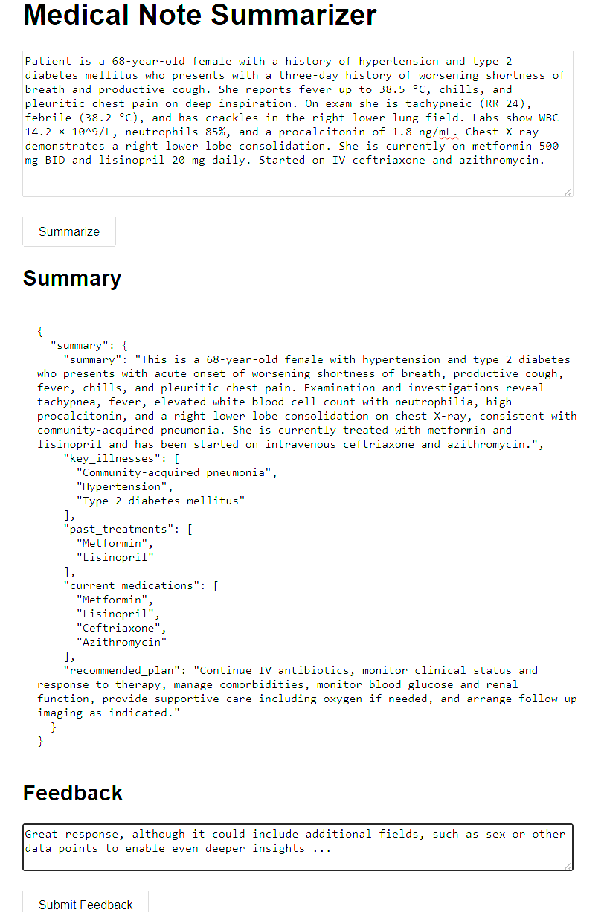

# Medical Summarization Service

A proof-of-concept FastAPI application that takes clinical‑note text and returns concise summaries via the OpenAI API.



Includes:
* A simple single-page UI
* File-based feedback collection
* Docker containerization

## Innovations

* Consistent JSON format from the LLM, ensuring structured output across all summaries.
* File-based feedback collection to capture clinician insights for model tuning.

---

## Quickstart

### 1. Clone the repo

```bash
git clone https://github.com/<your-user>/medical-summarizer.git
cd medical-summarizer
```

### 2. Create the .env

```bash
cp .env.example .env
```

### 3. Install and run locally

```bash
python3 -m venv .venv
source .venv/bin/activate

pip install --upgrade pip
pip install -r requirements.txt

uvicorn app.main:app --reload --host 0.0.0.0 --port 8000
```

Browse to [http://localhost:8000/](http://localhost:8000/) to use the UI.

## Docker Build

Pull and run the published image:

```bash
docker pull daniyalshahzad/med-summarizer:latest

docker run -p 8000:8000 \
  -e OPENAI_API_KEY=$OPENAI_KEY \
  -e MODEL_NAME=gpt-4.1 \
  daniyalshahzad/med-summarizer:latest
```
## API Reference

### GET /health

**Returns:**

```json
{ "status": "ok" }
```

### POST /summarize

**Request:**

```json
{ "text": "65-year-old male with chest pain…" }
```

**Returns:**

```json
{
  "summary": "…",
  "key_illnesses": [ "hypertension", "angina" ],
  "past_treatments": [ "angioplasty" ],
  "current_medications": [ "aspirin", "nitroglycerin" ],
  "recommended_plan": "Follow up in 2 weeks"
}
```

**Errors:**

* `400` if the request is empty
* `502` if the summarization service fails

### POST /feedback

**Request:**

```json
{
  "request_id": "12345-abcd",
  "feedback": "Missing lab values section."
}
```

**Response:**

```json
{
  "message": "Feedback recorded",
  "request_id": "12345-abcd"
}
```

## Future Enhancements
* Integrate follow up question using a memory and a chat functionality.

* Protection against Prompt hacking

* Rare-diagnosis highlighting: force focus on statistically unlikely illnesses to prompt consideration by clinicians

* Internet search integration: retrieve drug specifications and medical data from external sources

* Retrieval‑Augmented Generation (RAG): incorporate external knowledge bases into summaries